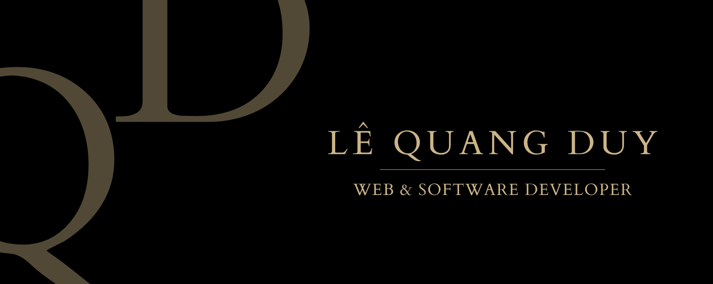

<h1 align="center">Hi 👋, I'm Lê Quang Duy</h1>
<h3 align="center">A passionate Programmer from Viet Nam</h3>

I love exploring new tech stack 💻 and leveraging them to build cool stuffs 🛠️

<h3 align="left">Languages and Tools:</h3>

- Programming Language

  

- Frontend

  

- Backend

  

- Tools

  

 

 Created with 🧡 by <a href="https://duylq-dev.vercel.app">Lê Quang Duy</a>

